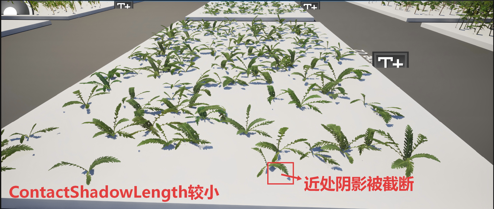
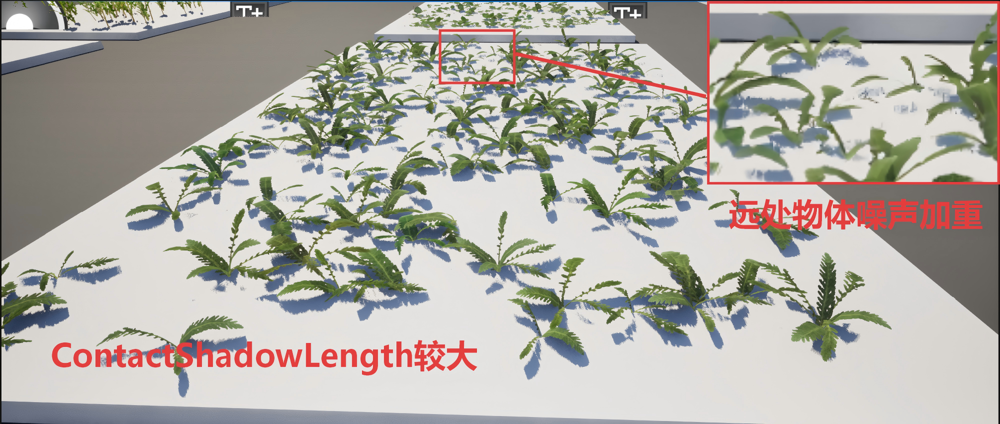
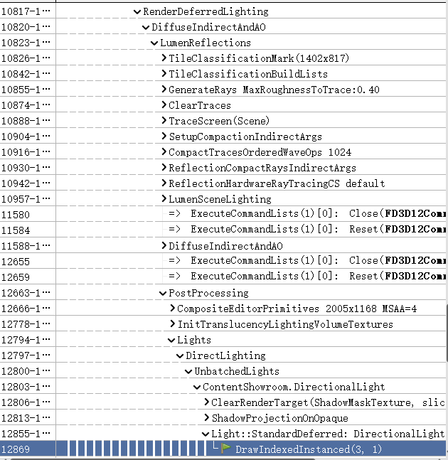
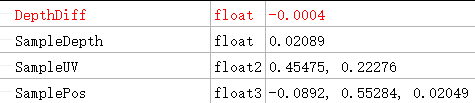

# Contact Shadow

### 算法原理

对屏幕空间中的像素沿着光线方向做RayMarching，

通过Ray采样深度与屏幕空间深度缓冲的关系来判断起点像素是否被遮蔽


#### 特点

**开销相对较小**，在**草地或小型物体**的渲染中可以用来代替VSM

#### 缺点

该方法是建立在假设屏幕空间中的物体有一定的厚度的基础上：

1. 但Grass的是一个面片或极薄的物体，在假设的Thickness的情况下会产生较厚的阴影

2. 在UE的实现中设置了Ray的StepNum为8，导致光线步长过大时在RayMarching中可能会穿透Grass，在视线与光线夹角越大越明显，进而在阴影中产生大量噪点

   |                           较大夹角                           |                           中等夹角                           |                           较小夹角                           |
   | :----------------------------------------------------------: | :----------------------------------------------------------: | :----------------------------------------------------------: |
   |  |  |  |

3. 对于ContactShadowLength设置较小时，容易导致近处物体的阴影截断；设置较大时，则会导致远处物体产生噪声和伪影

   

   

   

#### UE中Deferred Shading

MRT[1] = ( WorldNormal_Compressed.xyz, PerObjectGBufferData.x);

MRT[2] = ( Metallic, Specular, Roughness, ShadingModelID + SelectiveOutputMask);

MRT[3] = ( BaseColor.xyz, GenericAO);

MRT[4] = ( CustomData);

#### UE中的ContactShadow截帧分析

计算ContactShadow的阶段位于DeferredLighting中



|  |  |
| ------------------------------------------------------------ | ------------------------------------------------------------ |

开启了ContactShadow：Normal.a = 0.33333

未开启的物体：Normal.a = 0


**对正常接触阴影像素及其相邻的噪点Debug：**

|                           正常Hit                            |                          未正常Hit                           |
| :----------------------------------------------------------: | :----------------------------------------------------------: |
|  |  |

由该数据得知噪点产生的主要原因即步长过长导致未能采样到Grass的位置

#### 源码分析

Shader部分主要位于

```
DerferredLightingCommon.ush, DeferredLightPixelShaders.usf, ScreenSpaceShadowRayCast.ush
```


##### 函数调用堆栈

```c++
CastScreenSpaceShadowRay()

ShadowRayCast()

CastContactShadow()

ApplyContactShadowWithShadowTerms()

GetDynamicLighting()

DeferredLightPixelMain()
```


```c++
float CastScreenSpaceShadowRay(
    float3 RayOriginTranslatedWorld,   // 射线起点（Translated World 空间）
    float3 RayDirection,               // 射线方向（世界空间）
    float RayLength,                   // 射线最大长度
    int NumSteps,                      // RayMarching 步数
    float Dither,                      // 抖动值（用于减少带状伪影）
    float CompareToleranceScale,       // 深度比较容差缩放
    bool bHairNoShadowLight,           // 头发特殊光照处理标志
    out float2 HitUV)                  // 输出命中的屏幕UV
{
    // ===== 1. 将射线起点转换到裁剪空间 =====
    float4 RayStartClip = mul(float4(RayOriginTranslatedWorld, 1), View.TranslatedWorldToClip);

    // ===== 2. 计算射线终点，变换到裁剪空间 =====
    float4 RayDirClip = mul(float4(RayDirection * RayLength, 0), View.TranslatedWorldToClip);

    float4 RayEndClip = RayStartClip + RayDirClip;

    // ===== 3. 透视除法，转换到 NDC 空间 =====
    float3 RayStartScreen = RayStartClip.xyz / RayStartClip.w;
    float3 RayEndScreen   = RayEndClip.xyz   / RayEndClip.w;

    // ===== 4. 计算屏幕空间中的射线方向 =====
    float3 RayStepScreen = RayEndScreen - RayStartScreen;

    // ===== 5. 转换到屏幕UV空间（0~1范围） =====
    float3 RayStartUVz = float3(
        RayStartScreen.xy * View.ScreenPositionScaleBias.xy + View.ScreenPositionScaleBias.wz,
        RayStartScreen.z
    );

    float3 RayStepUVz = float3(
        RayStepScreen.xy * View.ScreenPositionScaleBias.xy,
        RayStepScreen.z
    );

    // ===== 6. 将视空间 Z 方向上长度为 RayLength 的向量变换到 Clip 空间 =====
    float4 RayDepthClip = RayStartClip + mul(float4(0, 0, RayLength, 0), View.ViewToClip);
    float3 RayDepthScreen = RayDepthClip.xyz / RayDepthClip.w;

    // ===== 7. 计算每一步的步长 =====
    const float StepOffset = Dither - 0.5f; // 抖动偏移，减少带状伪影
    const float Step = 1.0 / NumSteps;      // 单次步进比例

    // ===== 8. 计算深度比较容差 =====
    // 容差随射线长度变化，避免远处误判
    const float CompareTolerance =
        abs(RayDepthScreen.z - RayStartScreen.z) * Step * CompareToleranceScale;

    // ===== 9. 初始采样时间（带抖动）=====
    float SampleTime = StepOffset * Step + Step;

    // ===== 10. 获取起点像素的深度 =====
    const float StartDepth = LookupDeviceZ(RayStartUVz.xy);

    // ===== 11. RayMarching 主循环 =====
    UNROLL
    for (int i = 0; i < NumSteps; i++)
    {
        // 当前采样位置（UV + 深度）
        float3 SampleUVz = RayStartUVz + RayStepUVz * SampleTime;

        // 从深度缓冲中读取当前像素深度
        float SampleDepth = LookupDeviceZ(SampleUVz.xy);

        // ===== 避免自相交 =====
        // 如果采样点深度等于起点深度，则说明仍在同一像素
        // 头发特殊情况例外
        if (SampleDepth != StartDepth || bHairNoShadowLight)
        {
            // 计算射线深度与场景深度差
            float DepthDiff = SampleUVz.z - SampleDepth;

            // 判断是否命中
            // 如果射线深度落入容差范围内，认为发生遮挡
            bool Hit = abs(DepthDiff + CompareTolerance) < CompareTolerance;

            if (Hit)
            {
                // 输出命中的UV
                HitUV = SampleUVz.xy;

                // ===== 屏幕边界检查 =====
                // 如果UV超出[0,1]，认为无效
                bool bValidUV = all(and (0.0 < SampleUVz.xy, SampleUVz.xy < 1.0));

                // 返回命中距离
                return bValidUV ? (RayLength * SampleTime) : -1.0;
            }
        }

        // 前进一步
        SampleTime += Step;
    }

    // 未命中
    return -1;
}
```

|                  关键参数                   |                解释                |
| :-----------------------------------------: | :--------------------------------: |
| ContactShadowLength( 0 ~ 0.1, Screen Space) | RayMarching覆盖长度(1表示整个屏幕) |
|        CompareToleranceScale = 2.0f         |              厚度容差              |
|                 StepNum = 8                 |           步进数(采样数)           |

### 优化思路

1. **深度自适应StepNum与ContactShadowLength：**
   近处物体采用更大的ContactShadowLength和StepNum，远处物体保持原有的适当参数配置，并平滑过渡中间物体
2. **视角自适应StepNum：**
   对**视线与光线夹角**越大的部分设置更大的StepNum

##### 实际表现

| 阴影方法及其参数                                             |                                                              |
| ------------------------------------------------------------ | ------------------------------------------------------------ |
| Contact Shadow：ContactShadowLength = 0.05 CompareTolerance = 2.0f <br />StepNums = 8 |  |
| Contact Shadow: <br />ContactShadowLength = 0.1        **CompareTolerance = 0.5f** <br /> **StepNums = 8** (x1 Sample) |  |
| Contact Shadow: <br />ContactShadowLength = 0.1        **CompareTolerance = 0.5f** <br /> **StepNums = 16** (x2 Sample) |  |
| Contact Shadow：<br />ContactShadowLength = 0.1  **CompareTolerance = 0.5f** <br />**StepNums = 24** (x3 Sample) |  |
| **Bend Contact Shadow:** <br />SurfaceThickness = 0.005      |  |
| VSM                                                          |                                      |
| Shadow Mapping                                               |                  |


