# Contact Shadow

#### 原理

在屏幕空间中的像素做RayMarching，通过Ray采样深度与屏幕空间深度缓冲的关系来判断起点像素是否被遮蔽

#### 特点

在**草地或小型物体**的渲染中**开销相对较小**

#### 缺点

该方法是建立在假设屏幕空间中的物体有一定的厚度的基础上：

1. 但Grass的是一个面片或极薄的物体，在假设的Thickness的情况下会产生较厚的阴影
2. 在UE的实现中设置了Ray的StepNum为8，导致光线步长过大时在Marching中可能会穿透Grass，在视线与光线夹角越大越明显，进而在阴影中产生大量噪点

#### 可能的改进方向

1. 使用**低分辨率的深度图**进行深度采样，使光线更容易采样到草所在的深度，可以一定程度上缓解穿透问题

2. 减小CompareTolerance，对**视线与光线夹角**越大的部分设置更大的stepNum

   | 较大夹角                                                     | 中等夹角                                                     | 较小夹角                                                     |
   | ------------------------------------------------------------ | ------------------------------------------------------------ | ------------------------------------------------------------ |
   | 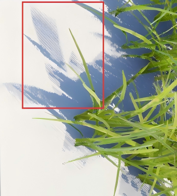 | 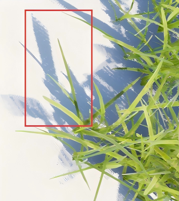 | 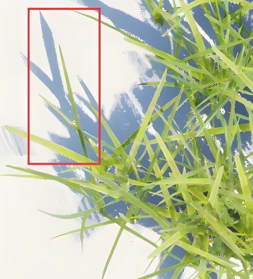 |

   

3. 采用类似SSR的Hi-Z Buffer来动态调整步长进行采样

#### UE中Deferred Shading

MRT[1] = ( WorldNormal_Compressed.xyz, PerObjectGBufferData.x);

MRT[2] = ( Metallic, Specular, Roughness, ShadingModelID + SelectiveOutputMask);

MRT[3] = ( BaseColor.xyz, GenericAO);

MRT[4] = ( CustomData);

#### UE中的ContactShadow

| 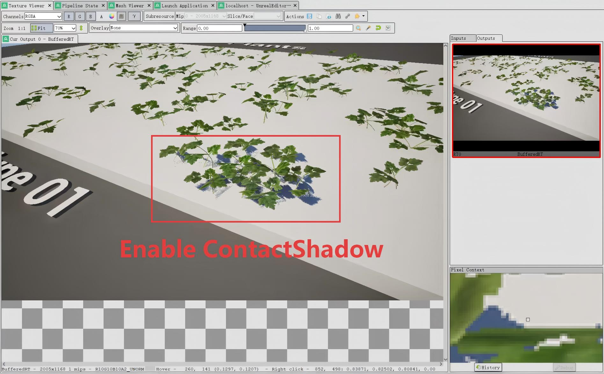 | 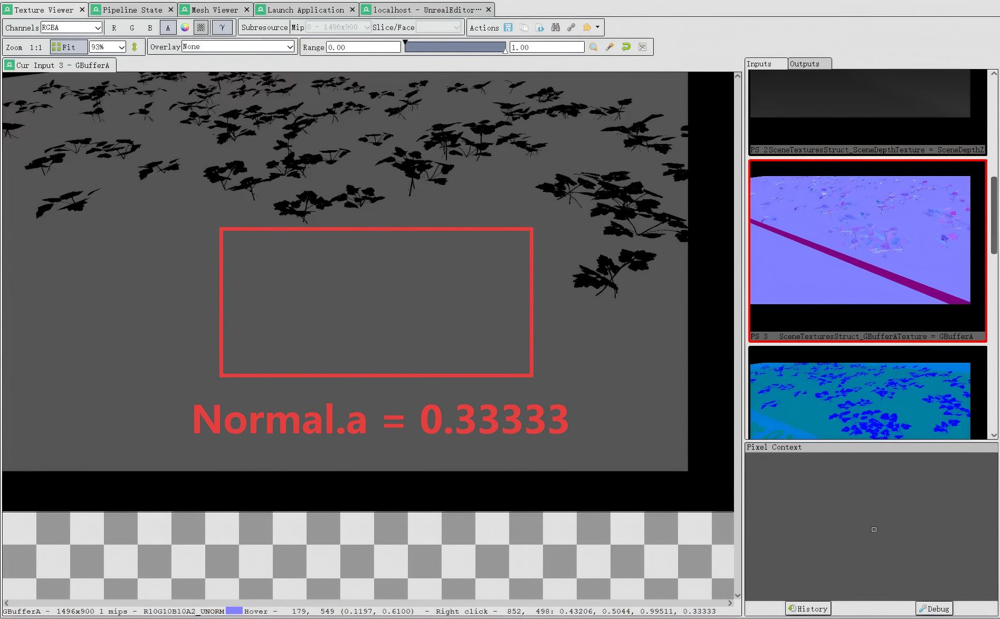 |
| ------------------------------------------------------------ | ------------------------------------------------------------ |

开启了ContactShadow：Normal.a = 0.33333

未开启的物体：Normal.a = 0

##### 实际表现

| 阴影方法及其参数                                             |                                                              |
| ------------------------------------------------------------ | ------------------------------------------------------------ |
| Contact Shadow：ContactShadowLength = 0.05 CompareTolerance = 2.0f  StepNums = 8 | 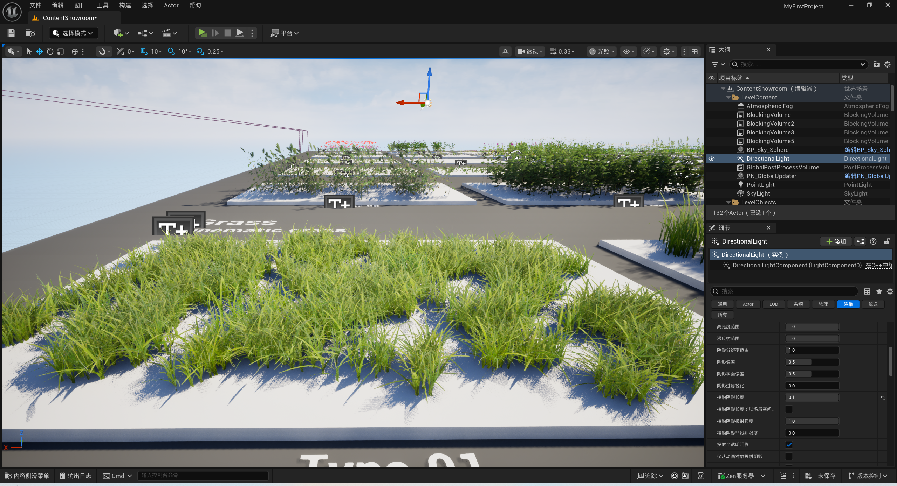 |
| Contact Shadow:  ContactShadowLength = 0.1        **CompareTolerance = 0.5f**   **StepNums = 8** (x1 Sample) | 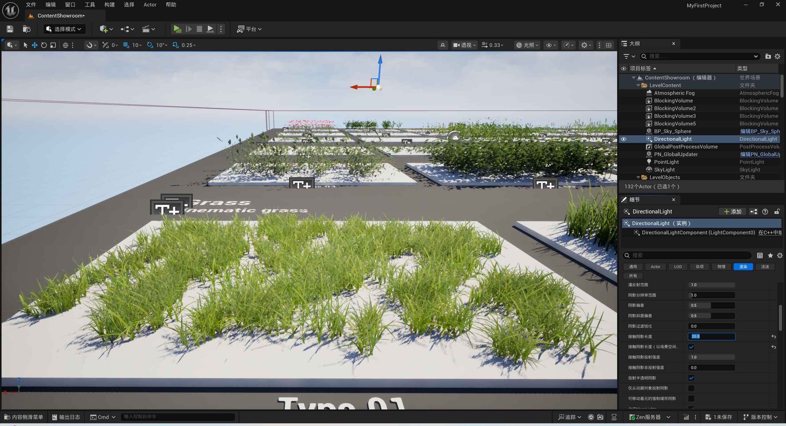 |
| Contact Shadow:  ContactShadowLength = 0.1        **CompareTolerance = 0.5f**   **StepNums = 16** (x2 Sample) | 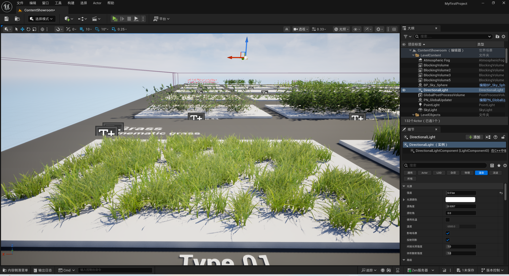 |
| Contact Shadow： ContactShadowLength = 0.1  **CompareTolerance = 0.5f**  **StepNums = 24** (x3 Sample) | 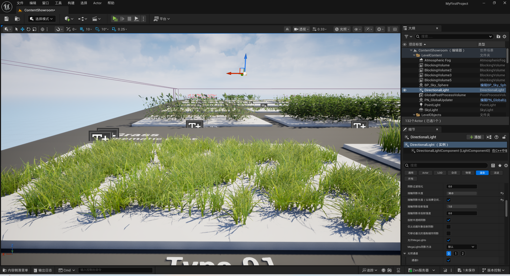 |
| **Bend Contact Shadow:**  SurfaceThickness = 0.005      | 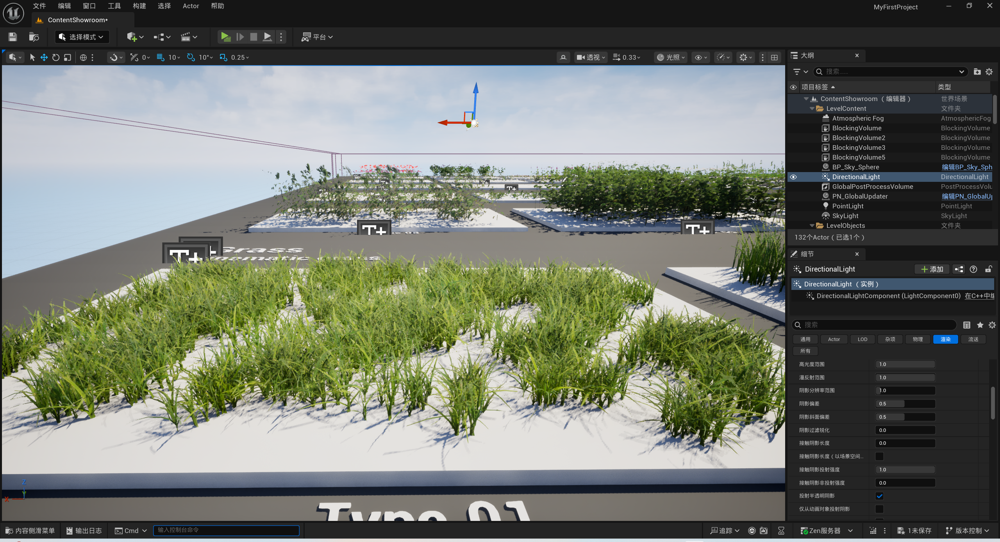 |
| VSM                                                          | 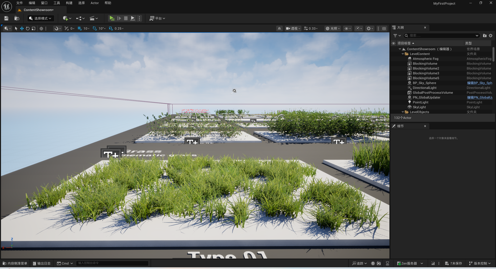                                     |
| Shadow Mapping                                               | 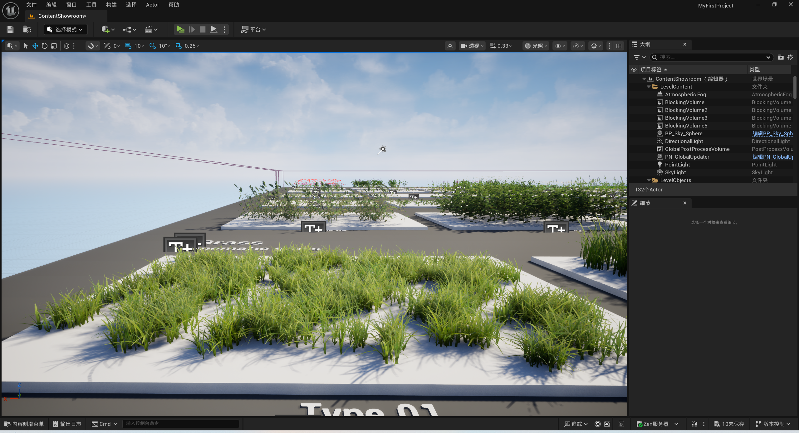                 |

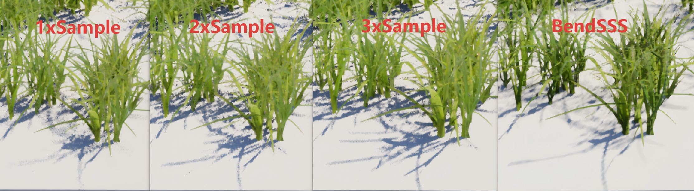

